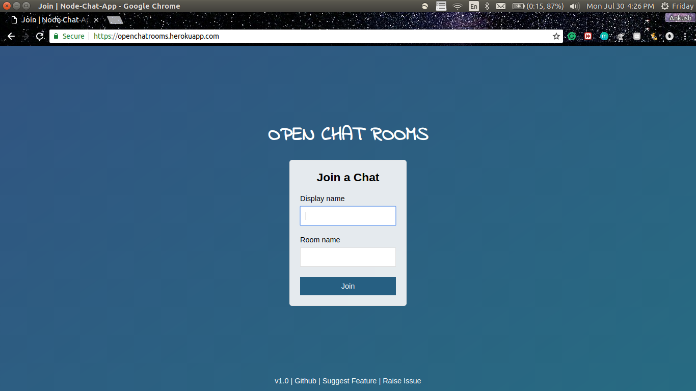
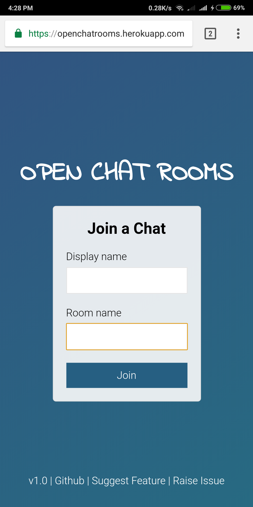
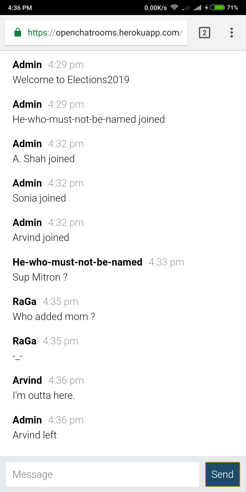
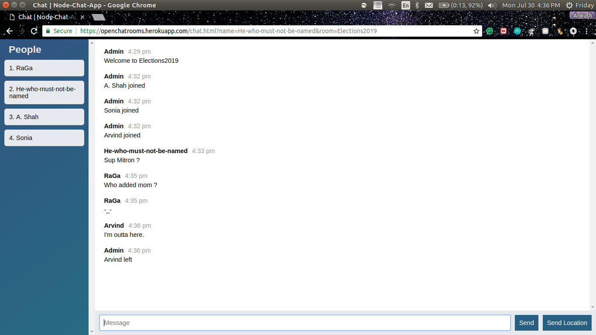

# Open Chat Rooms v1.0

  &nbsp;&nbsp;
  &nbsp;&nbsp;

Anonymous open chat rooms, where no history of your conversations will ever be created.

# How to use it ?
Just go to __[Open-Chat-Rooms](https://openchatrooms.herokuapp.com/)__, Choose a random (anonymous, if you want) Display Name and Room Name. Invite the people you want to have a private conversation with, to join in the same room. That's it!

# Features
- None of the conversation will be stored anywhere.
- Your conversation will be vanished once and for all, as soon as everyone leaves the room.
- Anyone can join in the conversation with just the Room's name.
- You'll see the list of people, who are in the room real-time.
- ___[New]___ You can share a pin to your current location with the click of a button.

# In Action

# Upcoming Features
- [Private Rooms] that require a password to join in.
- List of all the currently active rooms with number of people in it.

# Contribution
Feel free to raise issues, if you find any errors or have some suggestions that can make this application better.
